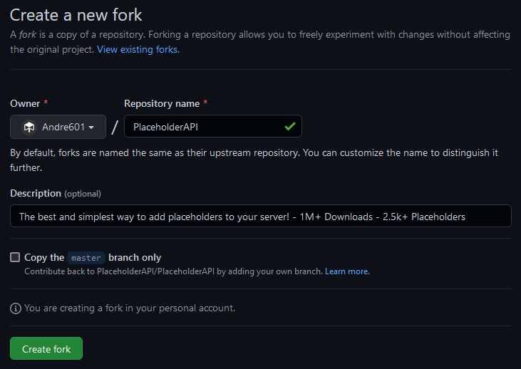
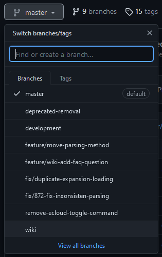
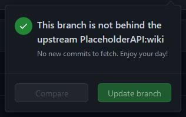
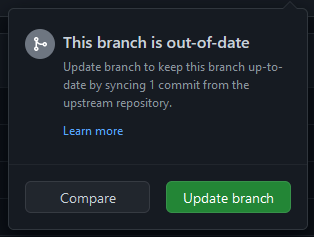
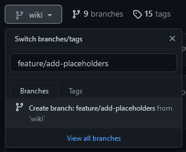
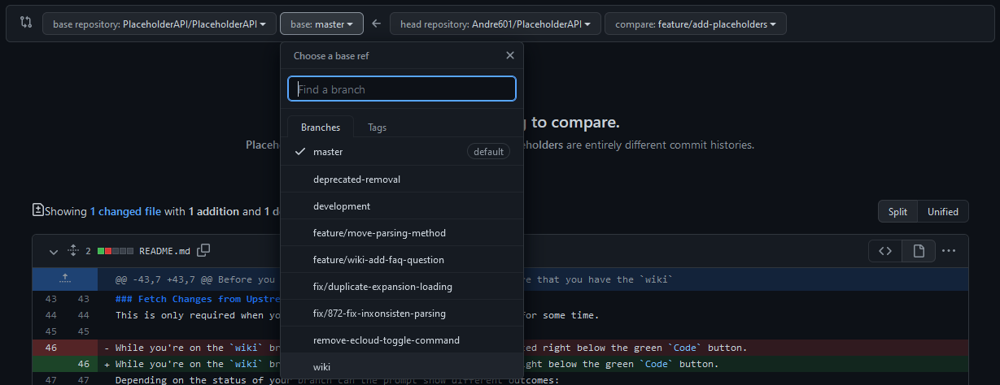

[wiki]: https://wiki.placeholderapi.com

[placeholders]: https://wiki.placeholderapi.com/users/placeholder-list/
[using_papi]: https://wiki.placeholderapi.com/users/plugins-using-placeholderapi/

[discord]: https://discord.gg/HelpChat
[discussion]: https://github.com/PlaceholderAPI/PlaceholderAPI/discussions

[expansion-generator]: https://papi.andre601.ch

[andre]: https://github.com/Andre601
[mkdocs]: https://www.mkdocs.org

<!-- Images -->

# Wiki
Welcome to the Wiki folder!

This folder contains all the files of the [PlaceholderAPI Wiki][wiki].  
It allows you to contribute towards the wiki and us to have more control about what changes are commited to it.

## Contrbuting to the wiki
If you want to contribute towards the wiki, will you need to follow the below instructions to not get your Pull request closed without a warning.

### Fork the Repository (Not wiki!)
> Already having a fork? Skip to the [next Step](#select-target-branch)!

You need to make a fork of the PlaceholderAPI Repository to contribute towards the wiki.  
To fork the repository, click the button on the top-right that says "Fork". In the new page, select the account/organisation you want to fork this repository towards and make sure to have "Copy the `master` branch only" unchecked, so that the `wiki` branch is copied too.  
After this, click "Create fork".



The forking process should only take a few seconds and you should be redirected to your fork afterwards.

### Select target branch
All main changes to the wiki are made on the dedicated `wiki` branch.  
Before you try to make any changes should you make sure that you have the `wiki` branch selected. To do that, check the button next to the `X branches` text. If it says anything other than `wiki` will you need to click it and select the right branch.



### Fetch Changes from Upstream
This is only required when you already had a fork and didn't update it for some time.

While you're on the `wiki` branch, click the `Sync Fork` text located right below the green `Code` button.  
Depending on the status of your branch can the prompt show different outcomes:

- `This branch is not behind the upstream PlaceholderAPI:wiki`  
  Your fork's `wiki` branch is up-to-date with the latest changes from Upstream (This Repository). You don't have to update anything.  
  
- `This branch is out-of-date`  
  Your fork's `wiki` branch is outdated and should be updated. Press the "Update branch" button to do so.  
  

### Commit changes
To commit changes will you need to choose, if you want to directly commit to your fork's `wiki` branch, or make a dedicated branch for it.

#### Make separate branch (Optional)
If you want to have a dedicated branch for it, will you need to click the button saying `wiki`, type in the small text field the name of the branch you want to use and click the text saying `Create branch: <branch> from 'wiki'`



After that should you now have a separate branch that is based of the `wiki` branch and you can finally commit changes to it.

#### Formatting
The wiki uses Markdown for formatting. While most markdown is the one you may already be familiar with, are there special cases you need to keep in mind. Namely:

- New lines in lists need to be indendet by 4 spaces. Also, two spaces at the end for a line break is also needed.
  Example:
  ```markdown
  - Line 1  
      Line 2
  ```

In addition should you keep the following rules in mind:

- Unordered lists need to start with a `-` and not `*`. This is to not get it confused with *italic text* which uses single `*` characters.
- Use relative links to point to another page in the wiki and include the file extension too. Editors like VSCode may help you auto-completing the path.

#### Adding new Expansion
When you add a new expansion to the wiki's [Placeholder page][placeholders] will you need to follow the following format:  
````markdown
- ### [:name](:link)
    > :command
    
    :text
    
    ```
    :placeholders
    ```
````

There are a few extra rules you need to also keep in mind:

- `:name` would be the name of your Expansion, not the plugin (Unless it is integrated into your plugin).
  - Only embed a link, if your Expansion requires a plugin to function.
  - When linking to a Spigot page, make sure to sanitze the link.  
    This means that f.e. https://www.spigotmc.org/resources/placeholderapi.6245/ becomes https://www.spigotmc.org/resources/6245/
- `:command` should be replaced with either the PlaceholderAPI command to download your expansion from the eCloud (`/papi ecloud download :name`) or with `NO DOWNLOAD COMMAND` if no separate download is available.
- `:text` is optional and should only be provided to link to additional documentation, your own placeholder list, or explain more complicated placeholders/features.
- `:placeholders` will be the list of placeholders your expansion provides.  
  Please avoid specific examples (i.e. `%placeholder_player_user123%`) and instead use `<>` and `[]` to mark required and optional options respecively (`%placeholder_player_<player>%`)

**Note:**  
When your Expansion's entry is after and/or before other entries will you need to add `----` before or after it to separate it from other entries.

##### Example:  
````markdown
- ### SomeExpansion
    > NO DOWNLOAD COMMAND
    
    ```
    %someexpansion_placeholder%
    ```

----

- ### YourExpansion
    > NO DOWNLOAD COMMAND
    
    ```
    %yourexpansion_placeholder%
    ```

----

- ### AnotherExpansion
    > NO DOWNLOAD COMMAND
    
    ```
    %anotherexpansion_placeholder%
    ```
````

After you added your expansion to this page will you also need to add an entry to the list at the top of the page.  
You do so by adding `- **[:text](#:name)**` to the list, where `:text` is the text to display (Usually the name you set) and `:name` is the name you just set. If your expansion shares the exact same name as another entry on the page will you need to make sure that your expansion is listed **after** the other one AND that the list-entry has a `-1` appended to `#:name` (So f.e. `#expansion` becomes `#expansion-1`).

Finally can you now commit your changes and move forward to the [Plugins using PlaceholderAPI][using_papi] page in the wiki folder.

#### Adding new plugin
This step is only required if you either add a new plugin to the list, or you added an Expansion that is included in your own plugin.

Similar to the [Placeholders page][placeholders] does this page follow a specific format which we will explain real quick.

```markdown
- [:name](:link)
    - [?] Supports placeholders.
    - [?] Provides own placeholders. [:page]
```

Here are the following rules:

- `:name` needs to be replaced with the Name of your plugin.
- `:link` needs to be the link of the plugin's resource page.
  - If no resource page is available can a GitHub repository be linked (if available) or the link omited altogether)
  - When linking to a Spigot page, make sure to sanitze the link.  
    This means that f.e. https://www.spigotmc.org/resources/placeholderapi.6245/ becomes https://www.spigotmc.org/resources/6245/
- `[?]` needs to be replaced with either `[ ]` or `[x]` depending on whether the mentioned option is supported or not.
- `:page` needs to replace with the right value, depending on the conditions.
  - If your plugin provides own Placeholders for other plugins to use can you set `**[[Link](placeholder-list.md#:name)]**` where `:name` is the title you set in the placeholders page.
  - If your plugin does not provide own placeholders will you need to set `Link`.

### Make a Pull request
After you made your changes is it time to make a Pull request.

When you made changes to the branch should GitHub show you a prompt with a button saying "Compare & pull request". This prompt also shows up when you visit the upstream Repository while having changes on your fork.  
Press the button to proceed.


By default will GitHub select the `master` branch as the target, which is not what we want. To fix this, click the button saying `base:master` and select the `wiki` branch.

> [!NOTE]  
> When the branch selection only shows branches and not the actual repositories does it mean that you're prompted to PR to your own fork.  
> To fix this, press the "compare across forks" text shown, select `PlaceholderAPI/PlaceholderAPI` as the target repository (left side) and your fork as the source. Then select the wiki branch as mentioned above.



Finally, fill out the Pull request template and submit the Pull request.  
Congratulations! You've successfully made a Pull request for the wiki.

### Questions?
If you have any questions, do not hesitate to ask in the [HelpChat Discord][discord] or [open a new discussion][discussion] in this repository. We will be happy to help you.

### Tools
A simple [online-tool][expansion-generator] is provided by Andre601 that allows you to create new entries for expansions in the wiki.

### Credits
- The Wiki is maintained by [Andre601][andre].
- We use [MkDocs][mkdocs] to turn the Markdown files into static HTML pages that then get uploaded to GitHub Pages through a GitHub Actions workflow.
